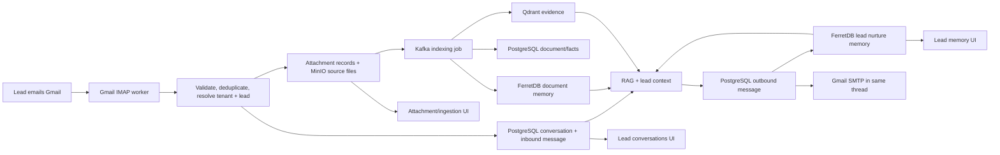

# Follei email, campaign, attachment, and lead-conversation implementation plan

Prepared: 29 July 2026 (Asia/Kolkata)  
Status: implementation plan — no provider credentials, production messages, or application behavior changed by this document.

## 1. Goal

Make email a first-class Follei channel.

When a known lead emails Follei:

1. Follei identifies the tenant and lead safely.
2. The email is added to that lead's canonical PostgreSQL conversation.
3. The same useful lead memory is projected to FerretDB.
4. Every safe attachment is retained and enters the existing System 1 document-ingestion pipeline.
5. Follei uses the existing grounded RAG + local Qwen reply path, with the lead's prior memory.
6. The reply is sent in the same email thread and is persisted.
7. The tenant UI displays the lead's email conversations, attachments, ingestion state, and FerretDB memory separately from voice/chat.

For outbound campaigns, a tenant admin can select leads, use `{{name}}` personalization, attach approved files, queue sends through Brevo, and inspect each recipient's outcome.

## 2. Decision: adapt the supplied files; do not drop them in unchanged

The five supplied Python files are a good integration sketch, but they are deliberately incomplete for Follei:

| Supplied file | Use in Follei | Required adaptation |
|---|---|---|
| `brevo_client.py` | Extend the existing async Brevo provider with attachment support | Use `httpx`, Follei settings, provider logs, and the communications outbox; do not make blocking `requests` calls inside a FastAPI request. |
| `campaign_api.py` | Use as the UX/API shape for a send/launch flow | Replace `get_current_tenant_id()` and all hook stubs with Follei authentication, tenant scope, campaign tables, recipient snapshots, and outbox delivery. |
| `inbound_watcher.py` | Use as the functional requirement for Gmail IMAP/SMTP | Extend the existing `GmailAutoReplyService`; do not create a second polling implementation. |
| `integration_hooks.py` | Use as an integration checklist | Implement direct calls to Follei's existing lead, RAG, conversation, object-storage, indexing, and campaign services rather than create a separate hooks package. |
| `models.py` | Merge useful response fields | Reuse/extend existing `app.schemas.campaign` schemas to avoid two API contracts. |

There is already substantial relevant Follei code:

- `app/services/communications/gmail_auto_reply.py` — Gmail IMAP/SMTP polling, loop protection, and in-thread replies
- `app/workers/gmail_auto_reply_worker.py` — worker entry point
- `app/services/communications/email_provider.py` — async Brevo transactional email provider
- `app/services/communications/brevo_inbound.py` — a separate inbound-provider design that must be consolidated, not run in parallel
- `app/services/rag/pipelines/chat.py` and `app/services/agents/support/worker.py` — the grounded answer path
- `app/services/knowledge/conversation_memory.py` — canonical PostgreSQL conversation persistence
- `app/services/knowledge/memory_store.py` — FerretDB lead nurture-memory projection
- `app/models/campaigns.py` — `Campaign`, `CampaignMessage`, `InboundEmail`, `OutboxMessage`, and provider log models
- `app/routers/verification_ui.py` and `app/static/tenant_console.html` — existing per-lead UI and storage inspection

## 3. Canonical architecture



PostgreSQL remains canonical. FerretDB is a bounded, queryable memory projection—not an unbounded duplicate of raw email files. Qdrant holds indexed, tenant-filtered evidence. MinIO retains the attachment source file.

## 4. Inbound Gmail flow

### 4.0 Tenant mailbox routing and lead matching rule

Each tenant must own a verified inbound mailbox connection. The mailbox, not a tenant name supplied by an external sender, determines the tenant.

Example:

- Tenant: `Pradeep`
- verified inbound mailbox: `pradeep824567@gmail.com`
- inbound sender: `x@x.com`

When Gmail delivers a message addressed to `pradeep824567@gmail.com`, Follei resolves that mailbox connection to the Pradeep tenant. It then searches **only Pradeep's active leads** for normalized email `x@x.com`.

| Sender outcome | Required Follei behavior |
|---|---|
| `x@x.com` is already a Pradeep lead | Reuse the lead. Load its FerretDB memory before generation, persist the email/thread/attachments against that lead, extend its knowledge asynchronously, and reply in the same thread if the reply policy permits it. |
| `x@x.com` is not a Pradeep lead | Create a new Pradeep lead with source `inbound_email`, status `new` or `unqualified`, and the sender email/name. Create the email conversation, preserve the attachment and ingestion records, and begin qualification/memory building. |
| `x@x.com` is a lead under another tenant | Do not reuse or reveal that record. It is an unknown sender for Pradeep and gets a new Pradeep-scoped lead only if inbound lead creation is enabled. |
| The recipient mailbox has no verified tenant mapping | Do not create a lead or reply automatically; place it in the operational error/manual-review queue. |

New leads created from inbound mail are eligible for one-to-one conversation handling, but they are **not automatically campaign-eligible**. Campaign eligibility requires the tenant's configured consent/opt-in policy. This prevents an unsolicited inbound contact from being silently added to bulk marketing.

The required connection record is conceptually:

```json
{
  "tenant_id": "<Pradeep tenant UUID>",
  "channel": "email",
  "provider": "gmail",
  "inbound_address": "pradeep824567@gmail.com",
  "status": "verified",
  "allow_inbound_lead_creation": true
}
```

For the current local MVP, a verified `GMAIL_MONITORED_EMAIL` plus `GMAIL_DEFAULT_TENANT_ID` can represent one such connection. Before multi-tenant production, this must become a tenant mailbox-connection table with one or more verified addresses per tenant.

### 4.1 Transport and threading

Use Gmail IMAP/SMTP for the existing `@gmail.com` mailbox:

- IMAP reads mail from `GMAIL_MONITORED_EMAIL` using a Gmail App Password.
- SMTP sends the reply from the same mailbox.
- Preserve `Message-ID`, `In-Reply-To`, and `References` so Gmail groups the reply in the same thread.
- A real Brevo-controlled domain can later use a Brevo inbound webhook, but that must call the same unified inbound service.

Brevo's transactional endpoint is appropriate for outbound delivery and supports transactional email operations, while Brevo separately documents inbound parsing and attachment retrieval for configured domains. [Brevo API documentation](https://developers.brevo.com/reference/send-transac-email)

### 4.2 Safety and identity rules

Before storing or replying, the worker must:

- reject self-mail, no-reply senders, mailer-daemon, bounces, automatic replies, list mail, and looped messages
- use a durable idempotency key based on provider + Gmail UID/message ID; do not rely only on an in-memory set
- resolve the lead by exact normalized email within a tenant
- derive the tenant from the matched lead; do not silently attribute an unknown external sender to an arbitrary production tenant
- place unmatched senders in an `unmatched`/manual-review queue, or create a lead only under an explicit tenant policy
- enforce a per-tenant and per-sender rate limit
- use a safe default: no automatic answer when confidence is low, facts conflict, or the lead requests a human

### 4.3 Persistence sequence

For a valid matched email:

1. Create or resume a `Conversation` with `channel="email"` and its Gmail thread/message ID in `metadata.external_session_id`.
2. Insert the inbound `Message` in PostgreSQL with direction `inbound`, source headers, provider message ID, and idempotency key.
3. Insert an `InboundEmail` audit record containing safe raw metadata and the raw body as needed for audit.
4. Create one `MessageAttachment` per attachment. Its metadata links to the object key, indexing job ID, document ID when available, original content type, size, and malware-scan state.
5. Put every permitted attachment into MinIO and create an `IndexingJob` using the same System 1 pipeline as `/upload`.
6. Call `handle_inbound_message(..., lead_id=<matched lead>, channel="email", session_id=<thread ID>)`. This already calls grounded RAG, persists the paired answer, and mirrors the pair through `append_lead_nurture_turn()` to FerretDB.
7. Send the approved reply using Gmail SMTP in-thread.
8. Store provider/send metadata and a delivery status on the outbound PostgreSQL message.
9. Trigger conversation summarization so BANT/MEDDIC and meaningful requirements update in FerretDB.

For an existing lead, the reply generation begins immediately from existing approved tenant knowledge, Qdrant evidence, and that lead's FerretDB memory. Attachment indexing continues in the background. For a newly created lead, the same email becomes the first conversation and first memory evidence; the first response must not claim prior knowledge about the sender.

### 4.4 Attachment behavior

Attachments must not block the core reply indefinitely.

- The inbound message and attachment records are saved first.
- The reply can acknowledge receipt and answer the email body using existing approved knowledge.
- The attachment is processed asynchronously through Kafka/System 1.
- The UI shows `queued`, `processing`, `review_ready`, `indexed`, or `failed` for each attachment.
- The AI must not claim it has read an attachment until its indexing/extraction result is available.
- If a later reply depends on attachment content, Follei retrieves the now-indexed document from Qdrant and its approved facts from PostgreSQL.

Allowed types, maximum size, ZIP/archive policy, MIME sniffing, filename sanitization, malware scanning, and a document quarantine path must be enforced before index queueing. Unsupported files remain auditable but are not parsed.

## 5. Exactly how lead conversations are stored today

### PostgreSQL — canonical record

`Conversation` is the lead's channel thread. It has `tenant_id`, `lead_id`, `channel`, status, title, summary, message count, and metadata.

`Message` stores each side of the exchange. It has `conversation_id`, `tenant_id`, role, direction, speaker, channel, content, sequence number, metadata, and an idempotency key.

`MessageAttachment` already exists and is the correct place to link a message to an email attachment and its stored/indexed document.

`ConversationCitation`, `ConversationSummary`, `ConversationIntent`, `ConversationSentiment`, and related rows retain grounding and analysis.

`InboundEmail` is available for inbound-email provider audit data. `CampaignMessage`, `OutboxMessage`, and `ProviderLog` are available for outbound campaign and provider records.

### FerretDB — lead memory used in replies

The current lead document is in the `tenant_context` collection under this key:

```json
{
  "tenant_id": "<tenant UUID>",
  "subject_type": "lead",
  "subject_id": "<lead UUID>"
}
```

It already includes bounded `nurture_history` entries such as:

```json
{
  "conversation_id": "<PostgreSQL conversation UUID>",
  "channel": "email",
  "user": "Lead's incoming email text",
  "assistant": "Follei's reply",
  "citations": [],
  "at": "<timestamp>"
}
```

It also holds accumulated facts such as requirements, budget signals, objections, preferences, competitors, BANT/MEDDIC evidence, and recent history. This is fed into the RAG prompt to tailor the next reply.

For email, the implementation will add thread/message IDs and attachment/document references to the conversation/message metadata and a compact email-memory projection. Raw attachment bytes remain in object storage, not FerretDB.

## 6. Existing frontend behavior and required frontend work

### Already visible

The tenant console's current lead-detail endpoint, `GET /ui/tenant/leads/{lead_id}`, returns:

- lead profile
- a conversation summary list
- up to 100 PostgreSQL nurture messages
- FerretDB qualification/nurture memory
- FerretDB import and crawl memory
- Qdrant evidence
- import, crawl, and indexing status

The current UI displays the lead's PostgreSQL nurture messages inline, labelled by channel. It is not yet a proper per-conversation mailbox view.

### Required UI design

Add a `Conversations` area within the selected lead detail with three views:

| View | Data shown |
|---|---|
| All conversations | Separate cards for each chat, voice, email, campaign, or WhatsApp thread; subject/title, channel, status, last activity, message count, and escalation status. |
| Selected conversation | Chronological transcript with inbound/outbound styling, sender, timestamp, confidence/escalation, citations, delivery state, and attachments. |
| Lead memory | The FerretDB facts and the bounded nurture history used to tailor responses, clearly marked as memory rather than the immutable source record. |

Add these tenant-scoped APIs:

- `GET /ui/tenant/leads/{lead_id}/conversations?channel=email&limit=...`
- `GET /ui/tenant/leads/{lead_id}/conversations/{conversation_id}`
- `GET /ui/tenant/leads/{lead_id}/attachments`
- `GET /ui/tenant/leads/{lead_id}/memory`

The selected transcript endpoint must join `MessageAttachment` and show each attachment's original filename, safe download action, indexing job/document IDs, and status. It must never expose raw object-storage credentials or cross-tenant records.

## 7. Sending documents in a reply

There are two separate cases.

### Campaign or manually composed email

The admin can attach a file. Follei stores it in tenant object storage first, records it as a campaign asset, and sends it through the outbox. The supplied Brevo attachment payload is appropriate after adding size/type validation and provider limits.

### AI reply to a lead request

The AI must not invent or attach arbitrary files. It may only select a document from an approved tenant-owned asset catalog, for example:

- approved pricing sheet
- approved proposal template
- approved product brochure
- an invoice already generated for that lead by an authorized billing workflow

The reply planner returns a structured `attachment_action` containing document ID, reason, and confidence. A policy layer checks tenant ownership, approval state, lead access, expiry, and human-approval requirements before the outbox sends it.

Invoices deserve stricter handling: Follei should attach an existing approved invoice or create one through a future billing integration. It must not generate a legally binding invoice solely from an LLM answer.

## 8. Campaign implementation plan

The supplied `POST /api/v1/campaigns/send` endpoint is useful as a first admin action, but direct synchronous sends are unsafe for production campaigns. Use this durable flow:

1. An authenticated tenant admin creates a campaign draft with subject, HTML/plain-text body, recipients or audience filter, and approved attachment assets.
2. Validate HTML, templates, file sizes/types, consent, suppression, and frequency caps.
3. Create a `Campaign` and immutable `CampaignMessage` rows—one per recipient.
4. Personalize `{{name}}` only from safe, tenant-owned lead fields.
5. Create `OutboxMessage` rows instead of sending inside the HTTP request.
6. Implement `CampaignWorker._process()` to claim, send, retry, and update each outbox/campaign message through the Brevo provider.
7. Record Brevo message IDs, provider logs, delivery/bounce/reply events, and suppression updates.
8. Mirror outbound messages into the lead's PostgreSQL conversation and FerretDB lead history.
9. Show campaign outcome in the campaign view and lead conversation timeline.

This preserves the convenient `send` action while making it reliable, auditable, tenant-safe, and retryable.

## 9. Implementation sequence

### Phase A — consolidate the existing email paths

- Select one `EmailInboundService` as the single business service.
- Reuse Gmail IMAP/SMTP as its current transport adapter.
- Make the existing Brevo inbound webhook call that same service when a managed inbound domain is used.
- Extend the async Brevo provider with attachments instead of adding a second synchronous client.
- Remove duplicate/dead routes only after tests prove the unified path.

### Phase B — durable inbound mail and attachment ingestion

- Add an Alembic migration for email-specific metadata/indexes if required.
- Add durable Gmail UID/Message-ID idempotency.
- resolve the receiving mailbox to its verified tenant connection before looking up the sender.
- create a tenant-scoped inbound lead when the sender is unknown and the connection permits creation.
- record the lead source and consent state separately; do not make inbound-created leads campaign-eligible by default.
- link inbound email to the exact `Lead` and `Conversation`.
- implement `MessageAttachment` creation, MinIO storage, and System 1 indexing job creation.
- pass `lead_id` into the existing Support/RAG pipeline.
- persist and mirror both the inbound email and generated response.
- add confidence, escalation, and safe auto-reply policy.

### Phase C — conversation and memory frontend

- add the three tenant-scoped APIs described above.
- add conversation list, transcript, attachment, and memory panels to `/tenant`.
- add filters for email, chat, voice, campaign, and status.
- make ingestion states visible without exposing sensitive raw payloads.

### Phase D — campaign send and document attachments

- implement authenticated campaign creation/launch.
- add recipient snapshotting, suppression, consent, and rate controls.
- persist campaign message/outbox rows before sending.
- extend the Brevo provider for approved attachments.
- implement campaign-worker delivery and provider event handling.
- add campaign UI and per-lead campaign timeline.

### Phase E — acceptance and live certification

- unit tests for parsing, idempotency, tenant resolution, thread headers, attachment validation, and RAG handoff.
- integration tests with mocked Gmail/Brevo and local PostgreSQL/FerretDB/Qdrant/MinIO/Kafka.
- live test: one known lead emails with a PDF/DOCX; verify Postgres, FerretDB, Qdrant, MinIO, and the tenant UI.
- live test: approved pricing sheet is attached to a specific lead's reply.
- live test: campaign sends to a small opted-in test audience and records provider IDs.
- failure test: duplicate email, unknown sender, bounce, low-confidence answer, malformed attachment, provider outage, and cross-tenant access attempt.

## 10. Required configuration and decisions before live sending

Required secrets/configuration:

- `BREVO_API_KEY`
- verified `BREVO_SENDER_EMAIL` and `BREVO_SENDER_NAME`
- `GMAIL_MONITORED_EMAIL`
- Gmail App Password with two-factor authentication enabled
- Gmail IMAP enabled for the mailbox
- a documented tenant-routing rule
- attachment size/type limits and malware-scanning choice
- auto-reply confidence threshold and escalation policy
- campaign consent/unsubscribe policy

Do not put API keys, app passwords, or attachments into Git or FerretDB.

## 11. Definition of done

Email/attachments/conversations are complete for the Follei local MVP when all of the following are true:

- a known lead can email the monitored Gmail address
- Follei matches the correct tenant and lead
- inbound email and attachments appear in the lead's selected email thread in the UI
- PostgreSQL has the canonical messages, attachment rows, and audit data
- FerretDB has a bounded lead-memory projection containing the inbound/outbound pair
- attachment source is in object storage and is indexed through System 1 into PostgreSQL, Qdrant, and FerretDB
- Follei's response uses the grounded lead-aware RAG path and is sent in the same Gmail thread
- a low-confidence/conflicting answer is escalated rather than sent as fact
- a tenant admin can send an approved pricing/proposal document to an opted-in target lead through the outbox
- campaign and individual sends are persisted, retryable, visible in the UI, and tenant-isolated

## 12. Recommended next implementation milestone

Start with Phase A + Phase B, then prove one live inbound email with one PDF attachment for a known test lead. This gives the most valuable end-to-end result—email conversation, lead memory, attachment ingestion, RAG reply, and frontend evidence—before building the broader campaign UI.
