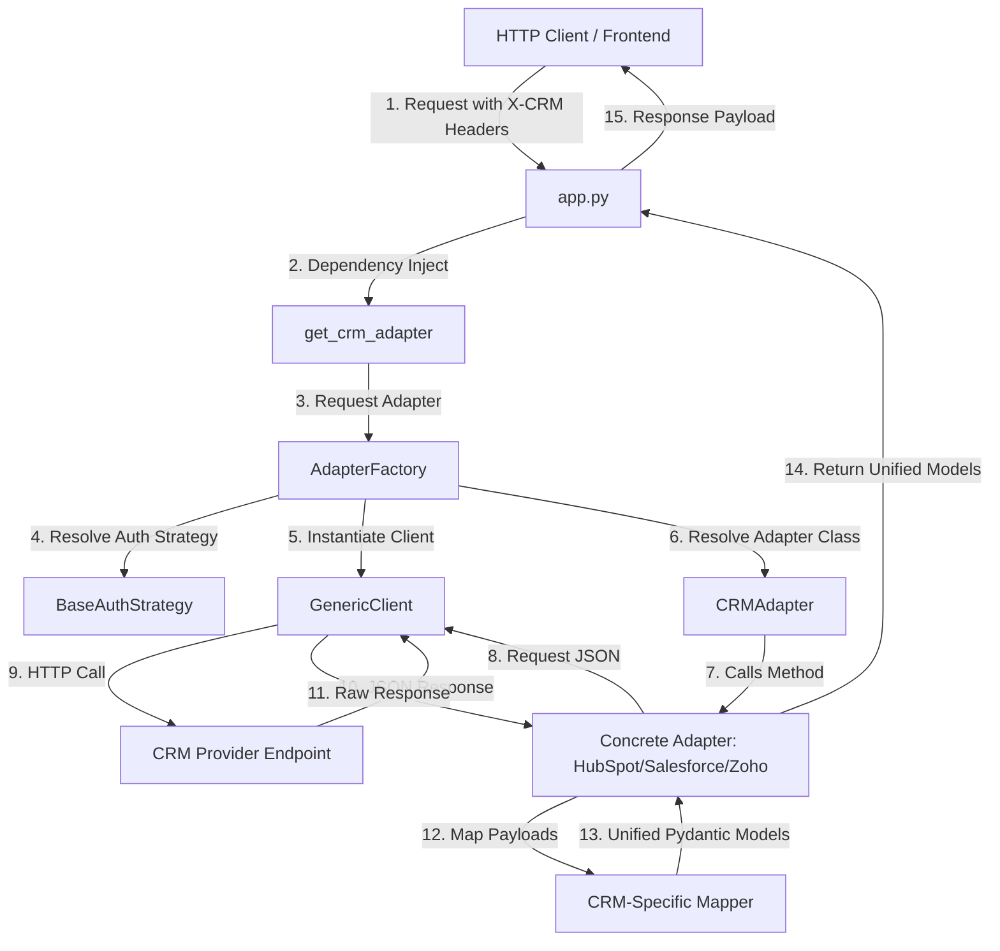

# CRM Gateway API

The **CRM Gateway API** is a production-ready unified gateway built on top of [FastAPI](file:///c:/Users/syedm/Synelime/coirei/mcp_crm/app.py) that standardizes interactions with three major CRM providers: **HubSpot**, **Salesforce**, and **Zoho CRM**.

By providing a single, consistent API contract, it shields client applications from the complexity of provider-specific APIs, differing authentication mechanisms, distinct naming conventions, pagination strategies, and raw payloads.

---

## Quickstart & How to Run

### 1. Prerequisites
- **Python 3.10** or higher
- `pip` (Python package manager)
- A tool to run requests (e.g., `curl`, Postman, or a web browser for interactive docs)

### 2. Installation
Clone/navigate to the project folder, set up a virtual environment, and install dependencies:

```bash
# Create a virtual environment
python -m venv venv

# Activate the virtual environment
# On Windows (Command Prompt)
venv\Scripts\activate.bat
# On Windows (PowerShell)
.\venv\Scripts\Activate.ps1
# On macOS/Linux
source venv/bin/activate

# Install the required packages
pip install -r requirements.txt
```

*Required dependencies are listed in [requirements.txt](file:///c:/Users/syedm/Synelime/coirei/mcp_crm/requirements.txt).*

### 3. Configuration
The gateway uses environment variables or a `.env` file to set default settings. Create a `.env` file at the root of the workspace:

```ini
# Environment settings
ENV=development
DEBUG=true

# Database and Token Encryption
DATABASE_URL=sqlite+aiosqlite:///./crm_gateway.db
ENCRYPTION_KEY=your-32-byte-fernet-encryption-key-for-tokens  # Auto-generated if empty

# HubSpot OAuth Settings
HUBSPOT_CLIENT_ID=your-hubspot-client-id
HUBSPOT_CLIENT_SECRET=your-hubspot-client-secret
HUBSPOT_REDIRECT_URI=http://localhost:8000/oauth/hubspot/callback
HUBSPOT_SCOPES="crm.objects.contacts.read crm.objects.contacts.write crm.objects.companies.read crm.objects.companies.write crm.objects.deals.read crm.objects.deals.write"

# Legacy Default Mock / Real credentials for verification & local dev
# (Clients can also pass credentials dynamically in headers)
HUBSPOT_BASE_URL=https://api.hubapi.com
HUBSPOT_TOKEN=your-default-hubspot-oauth2-token

# Zoho default settings (Optional fallbacks)
ZOHO_BASE_URL=https://www.zohoapis.com
ZOHO_TOKEN=your-default-zoho-oauth2-token

# Salesforce default settings (Optional fallbacks)
SALESFORCE_BASE_URL=https://login.salesforce.com
SALESFORCE_TOKEN=your-default-salesforce-oauth2-token
```

*See [config.py](file:///c:/Users/syedm/Synelime/coirei/mcp_crm/config.py) for the settings logic.*

### 4. Running the Server
Launch the application using `uvicorn`:

```bash
uvicorn app:app --reload
```

The server will start on `http://127.0.0.1:8000`.

### 5. Accessing API Documentation
FastAPI provides automatic, interactive API documentation:
- **Swagger UI**: [http://127.0.0.1:8000/docs](http://127.0.0.1:8000/docs)
- **ReDoc**: [http://127.0.0.1:8000/redoc](http://127.0.0.1:8000/redoc)

---

##  Dynamic Provider Execution Examples

The gateway allows you to target a specific CRM dynamically on each HTTP request by passing custom HTTP headers.

### HubSpot Example
Fetch contacts from HubSpot using an OAuth2 Bearer token:
```bash
curl -X GET "http://127.0.0.1:8000/contacts?limit=10" \
  -H "X-CRM-Provider: hubspot" \
  -H "X-CRM-Token: your_hubspot_pat_token" \
  -H "X-CRM-Auth-Type: oauth2"
```

### Salesforce Example
Fetch contacts from a custom Salesforce instance:
```bash
curl -X GET "http://127.0.0.1:8000/contacts" \
  -H "X-CRM-Provider: salesforce" \
  -H "X-CRM-Token: your_salesforce_access_token" \
  -H "X-CRM-Base-URL: https://yourcompany.my.salesforce.com" \
  -H "X-CRM-Auth-Type: oauth2"
```

---

##  OAuth 2.0 Authentication System

The gateway includes a production-ready, generic, and secure **OAuth 2.0 Authorization Code Flow** module that allows users to connect their CRM accounts (starting with **HubSpot**) without manually pasting tokens into configuration files.

###  Key Features
1. **Dynamic Provider Registry**: Providers (e.g. `HubSpotOAuthProvider`) inherit from a common `OAuthProvider` interface and register themselves globally. Adding a new provider requires no changes to existing business logic.
2. **Encrypted Token Storage**: Stored access and refresh tokens are symmetrically encrypted in the database using a 32-byte Fernet key (`ENCRYPTION_KEY`) to prevent plaintext leakage.
3. **Automated Token Manager**: The client never implements refresh checks manually. The centralized `TokenManager` verifies expiration timestamps on incoming requests and automatically performs OAuth refreshes using the stored refresh token when required, saving the renewed tokens back to the database.
4. **Dynamic Header Authentication**: Standard gateway endpoints can consume tokens dynamically from the database. Simply pass the `X-User-ID` header instead of `X-CRM-Token`:
   ```bash
   curl -X GET "http://127.0.0.1:8000/contacts" \
     -H "X-CRM-Provider: hubspot" \
     -H "X-User-ID: user_12345"
   ```

###  OAuth Endpoints

| Method | Endpoint | Query Params / Headers | Description |
|---|---|---|---|
| **GET** | `/oauth/{provider}/login` | `user_id` (Query) | Generates a random CSRF state, saves it, and redirects to the CRM login/authorization screen. |
| **GET** | `/oauth/{provider}/callback` | `code`, `state` (Query) | Validates CSRF state, exchanges authorization code for tokens, encrypts, saves connection details, and displays a polished success/error HTML landing card. |
| **POST** | `/oauth/{provider}/refresh` | `user_id` (Query) | Manually forces a token refresh for the user connection. |
| **DELETE** | `/oauth/{provider}/disconnect` | `user_id` (Query) | Revokes the token on the CRM platform (best-effort) and deletes the connection record from the database. |
| **GET** | `/oauth/{provider}/status` | `user_id` (Query) | Returns metadata about the connection (account name, Portal ID, scopes, expiration) without exposing secrets. |

---

##  Architecture Overview

The system architecture utilizes several classic software design patterns to achieve clean separation of concerns, high extensibility, and compile-time decoupling.



###  Key Design Patterns Used

#### 1. Adapter Pattern (Object Mapping & Command Unification)
Each CRM has its own REST structure (e.g. HubSpot uses a `properties` nesting object, Zoho wraps elements in a `{"data": [...]}` list, and Salesforce relies on SOQL queries).
- **Interface**: [CRMAdapter](file:///c:/Users/syedm/Synelime/coirei/mcp_crm/core/adapter.py) defines the abstract API contract.
- **Implementations**: 
  - [HubSpotAdapter](file:///c:/Users/syedm/Synelime/coirei/mcp_crm/crms/hubspot/adapter.py)
  - [SalesforceAdapter](file:///c:/Users/syedm/Synelime/coirei/mcp_crm/crms/salesforce/adapter.py)
  - [ZohoAdapter](file:///c:/Users/syedm/Synelime/coirei/mcp_crm/crms/zoho/adapter.py)
- **Mappers**: Each adapter delegates schema transformations to a static Mapper utility (e.g., [HubSpotMapper](file:///c:/Users/syedm/Synelime/coirei/mcp_crm/crms/hubspot/mapper.py), [SalesforceMapper](file:///c:/Users/syedm/Synelime/coirei/mcp_crm/crms/salesforce/mapper.py), [ZohoMapper](file:///c:/Users/syedm/Synelime/coirei/mcp_crm/crms/zoho/mapper.py)).

#### 2. Strategy Pattern (Pluggable Authentication)
To accommodate various CRM auth structures, the gateway implements a Strategy pattern in [core/auth.py](file:///c:/Users/syedm/Synelime/coirei/mcp_crm/core/auth.py):
- **[BaseAuthStrategy](file:///c:/Users/syedm/Synelime/coirei/mcp_crm/core/auth.py#L10)**: Abstract strategy specifying header/parameter configuration.
- **[OAuth2BearerAuth](file:///c:/Users/syedm/Synelime/coirei/mcp_crm/core/auth.py#L28)**: Injects `"Authorization": "Bearer <token>"`.
- **[APIKeyHeaderAuth](file:///c:/Users/syedm/Synelime/coirei/mcp_crm/core/auth.py#L38)**: Injects API key into custom header.
- **[APIKeyQueryAuth](file:///c:/Users/syedm/Synelime/coirei/mcp_crm/core/auth.py#L49)**: Appends API key to URL query string.
- **[BasicAuth](file:///c:/Users/syedm/Synelime/coirei/mcp_crm/core/auth.py#L60)**: Base64 encodes credentials and injects standard basic authorization headers.

#### 3. Factory Pattern (Instantiator)
The [AdapterFactory](file:///c:/Users/syedm/Synelime/coirei/mcp_crm/core/factory.py#L59) encapsulates adapter registration:
- Resolves the requested CRM string to its concrete adapter.
- Constructs the corresponding `BaseAuthStrategy`.
- Spawns a configured [GenericClient](file:///c:/Users/syedm/Synelime/coirei/mcp_crm/core/client.py#L24) and injects it into the returned adapter class.

#### 4. Dependency Injection (Lifespan & Dynamic Adapters)
- **Client Pooling**: The gateway uses FastAPI's `lifespan` handler (see [app.py:L37](file:///c:/Users/syedm/Synelime/coirei/mcp_crm/app.py#L37)) to spin up a single persistent `httpx.AsyncClient`. This pooled client is shared across all incoming requests to avoid socket exhaustion and optimize latency.
- **Request resolution**: FastAPI's `Depends` resolves [get_crm_adapter](file:///c:/Users/syedm/Synelime/coirei/mcp_crm/app.py#L112) dynamically by parsing incoming HTTP headers, instantiating the adapter, and cleaning it up after request completion.

---

##  Repository Directory Structure

```text
mcp_crm/
│
├── app.py                  # FastAPI Application, Exception Handlers & Dynamic Dependency Injection
├── config.py               # Application settings, load .env defaults
├── requirements.txt        # Third-party libraries
├── .env                    # Local environment secrets and overrides
│
├── core/                   # Platform Architecture Layer
│   ├── adapter.py          # CRMAdapter base abstract class interface
│   ├── auth.py             # Auth Strategy pattern implementations
│   ├── client.py           # Reusable generic client wrapper over httpx.AsyncClient (supports dynamic token refresh)
│   ├── exceptions.py       # Custom unified exception hierarchy
│   └── factory.py          # Dynamic adapter generation based on provider names
│
├── database/               # Database Context & Repository Layer
│   ├── models.py           # SQLAlchemy tables (CRMConnection, OAuthState)
│   ├── connection.py       # Asynchronous engine & session setup (init_db, get_db)
│   └── repository.py       # Repo patterns for connection & CSRF token storage
│
├── oauth/                  # Dynamic CRM OAuth Integration Module
│   ├── base.py             # Abstract base class: OAuthProvider
│   ├── hubspot.py          # Concrete HubSpot OAuthProvider implementation
│   ├── token_manager.py    # Automatic token loaders, verification, and refresher
│   ├── crypto.py           # Symmetric token encryption utility (Fernet)
│   ├── registry.py         # Global provider registry (HubSpot, Zoho stub, Salesforce stub)
│   ├── schemas.py          # OAuth Pydantic request/response schemas
│   └── routes.py           # Router exposing dynamic provider login, callback, status, refresh, and disconnect
│
├── models/                 # Shared Data Schemas
│   └── schemas.py          # Unified Pydantic Models (Contacts, Companies, Deals)
│
├── crms/                   # Specific Provider Adaptations
│   ├── hubspot/
│   │   ├── adapter.py      # Concrete HubSpot CRMAdapter
│   │   ├── endpoints.py    # HubSpot REST endpoints
│   │   └── mapper.py       # HubSpot request/response translator
│   ├── salesforce/
│   │   ├── adapter.py      # Concrete Salesforce CRMAdapter using SOQL
│   │   ├── endpoints.py    # Salesforce REST endpoints
│   │   └── mapper.py       # Salesforce request/response translator
│   └── zoho/
│       ├── adapter.py      # Concrete Zoho CRMAdapter
│       ├── endpoints.py    # Zoho REST endpoints
│       └── mapper.py       # Zoho request/response translator
│
├── scratch/                # Verification Scripts
│   └── test_oauth.py       # Comprehensive unit & integration testing script
├── routes/                 # (Placeholder for future route refactoring)
└── services/               # (Placeholder for future business logic refactoring)
```

---

##  Unified Data Model

All adapters return Pydantic models defined in [models/schemas.py](file:///c:/Users/syedm/Synelime/coirei/mcp_crm/models/schemas.py). They are classified into:

| Domain | Standard Object | Creation Payload | Update Payload |
|---|---|---|---|
| **Contacts** | [Contact](file:///c:/Users/syedm/Synelime/coirei/mcp_crm/models/schemas.py#L19) | [ContactCreate](file:///c:/Users/syedm/Synelime/coirei/mcp_crm/models/schemas.py#L31) | [ContactUpdate](file:///c:/Users/syedm/Synelime/coirei/mcp_crm/models/schemas.py#L40) |
| **Companies** | [Company](file:///c:/Users/syedm/Synelime/coirei/mcp_crm/models/schemas.py#L51) | [CompanyCreate](file:///c:/Users/syedm/Synelime/coirei/mcp_crm/models/schemas.py#L61) | [CompanyUpdate](file:///c:/Users/syedm/Synelime/coirei/mcp_crm/models/schemas.py#L69) |
| **Deals** | [Deal](file:///c:/Users/syedm/Synelime/coirei/mcp_crm/models/schemas.py#L79) | [DealCreate](file:///c:/Users/syedm/Synelime/coirei/mcp_crm/models/schemas.py#L90) | [DealUpdate](file:///c:/Users/syedm/Synelime/coirei/mcp_crm/models/schemas.py#L99) |

*Note: All standardized models feature a `raw_properties: Dict[str, Any]` field which passes through the full unaltered response payload from the native CRM to avoid losing provider-specific metadata.*

---

##  Unified Error Taxonomy

The gateway features a robust exception mapping logic to isolate errors from raw HTTP issues and map them cleanly to standard HTTP responses in [app.py](file:///c:/Users/syedm/Synelime/coirei/mcp_crm/app.py):

```text
CRMGatewayException (Base Exception)
├── CRMConnectionException ───────► HTTP 503 (Connection error / Timeout)
├── CRMAdapterNotFoundException ──► HTTP 400 (Unsupported provider name)
├── CRMValidationException ───────► (Internal validation failure)
└── CRMClientException (HTTP Error)
    ├── CRMAuthException ─────────► HTTP 401 (Auth or authorization issues)
    ├── CRMRateLimitException ────► HTTP 429 (Rate limiting from CRM)
    └── CRMObjectNotFoundException ► HTTP 404 (Resource does not exist)
```

Errors are mapped automatically by [GenericClient._handle_response](file:///c:/Users/syedm/Synelime/coirei/mcp_crm/core/client.py#L111) and handled globally using FastAPI exception handlers to format consistent error payloads:

```json
{
  "detail": "CRM API error 404: Contact not found",
  "status": 404,
  "error_type": "ObjectNotFound"
}
```
